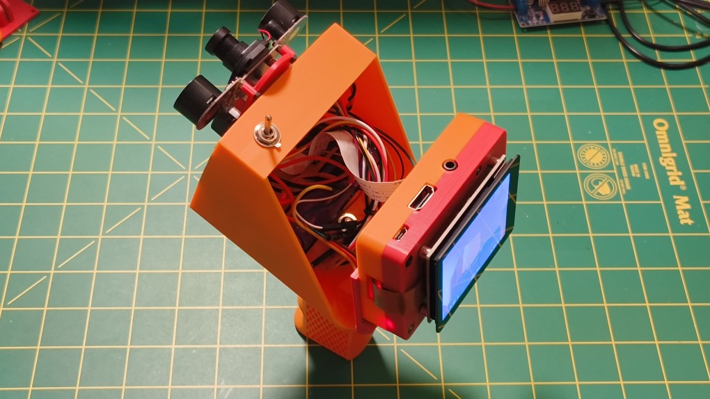
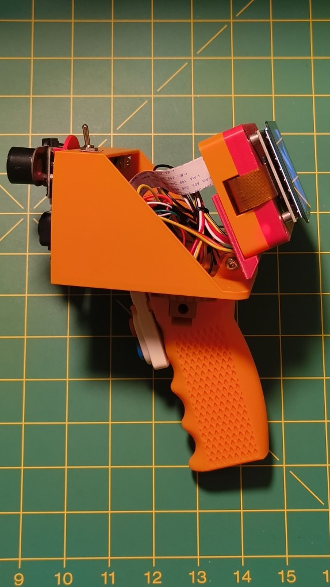
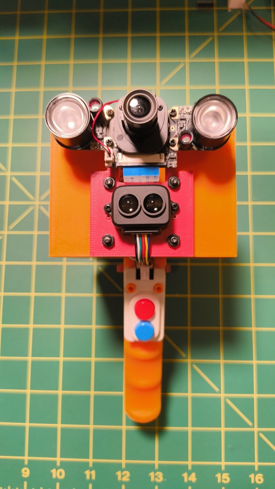
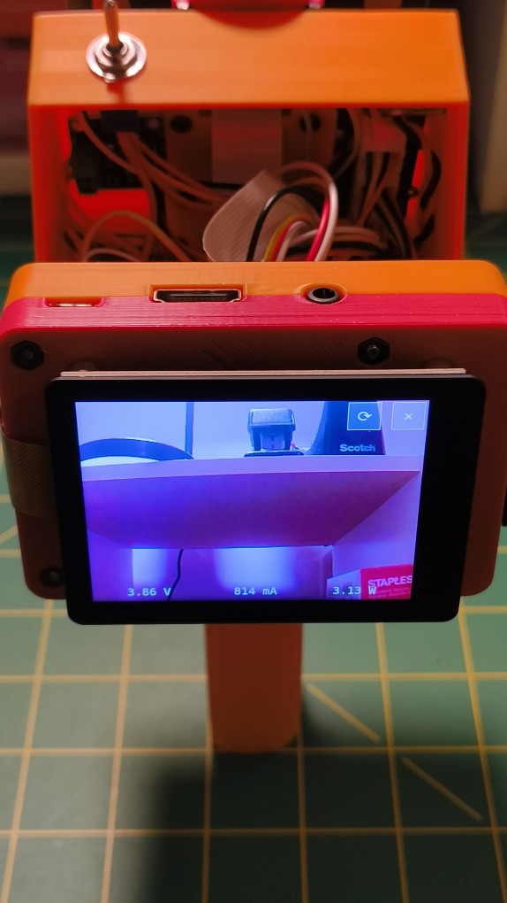

# Chaoscope

Infrared camera, Raspberry Pi, Lidar, in a convenient ~~vampire hunting~~ pistol grip form factor.

It's mostly ten-year-old kit -- a Pi 2, a 5 MP IR cut cam -- but hey, this
is more productive than the scrap heap...

### Major Components

- [Raspberry Pi 2 B](https://www.raspberrypi.com/products/raspberry-pi-2-model-b/)
- [Waveshare IR CUT 5MP camera](https://www.waveshare.com/wiki/RPi_IR-CUT_Camera)
- [M5Stack dual button unit](https://docs.m5stack.com/en/unit/dual_button)
- INA219 current/voltage monitor
- TP5100 battery charger
- 5V switching buck/boost voltage regulator
- 1 x 18650 lithium-ion battery

### Final form

